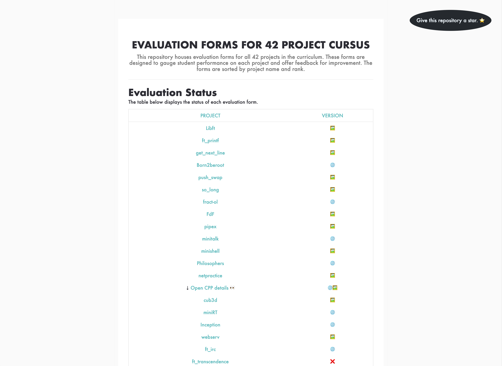

# 42 Project Evaluation Sheets 📝

## Contents

  <a href="#how-to-contribute-">How to Contribute</a> •
  <a href="#usage-of-sheets-">Usage of Sheets</a> •
  <a href="#related-repository-">Related Repository</a> •
  <a href="#feedback-">Feedback</a>

	
	

Welcome to the repository for all evaluation sheets related to the 42 school curriculum projects 🎓. These sheets, sourced from the official 42 site, are designed to help students self-evaluate before the real evaluation. They mirror the evaluation that students will receive during the actual project correction, providing a valuable resource for students to succeed on their first attempt 🎯.

For easy access and updates, visit [rphlr.github.io/42-Evals](https://rphlr.github.io/42-Evals/). The HTML versions of the evaluations will be updated progressively. If you wish to contribute an HTML file, kindly fork the repository, place the HTML file in the appropriate folder, and submit a pull request.

## How to Contribute 🤝

Your contributions to this repository are highly appreciated. If you wish to add an evaluation sheet for a project or enhance an existing one, please follow these steps:

1. Fork the repository
2. Clone your fork to your local machine
3. Update an evaluation or add a new one.
4. Commit the changes with a descriptive message
5. Push the changes to your fork
6. Submit a pull request

## Usage of Sheets 📚

The evaluation sheets are designed to assist students in self-assessing their performance on each project. They offer a standardized method for project evaluation and serve as a foundation for constructive feedback. To utilize the sheets, simply review the sections designated for grading.

## Related Repository 📂

Check out the [42-Subjects](https://github.com/rphlr/42-Subjects/) repository for a comprehensive collection of official PDF subjects for the 42 school projects, available in both English and French.

## Feedback 📣

Your feedback and suggestions for improvement are always welcome. Feel free to open an issue or submit a pull request. We look forward to hearing from you!
